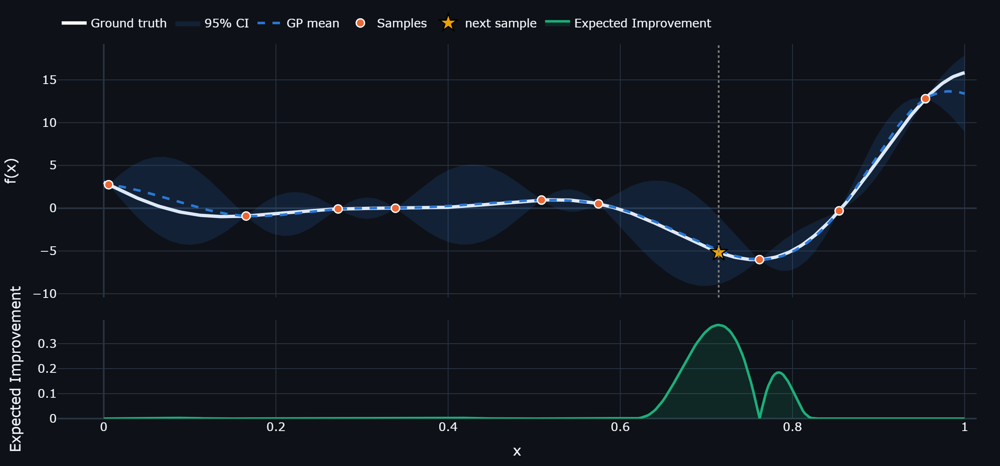
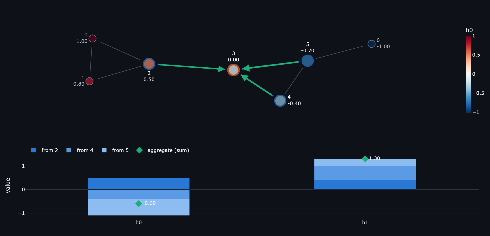

# Interactive Visualization Tools

Self-contained [Streamlit](https://streamlit.io) apps that make a machine learning method
**steppable**: change an input, and every intermediate quantity updates in front of you.

Each app is deliberately small — a handful of points, a seven-node graph, two or three
feature dimensions — so that the numbers on screen can be recomputed by hand. The aim is
not to run a method at scale, but to see exactly what it does on each step.

## The tools

| Tool | What it makes visible | Launch |
| --- | --- | --- |
| [Bayesian Optimization Explorer](#bayesian-optimization-explorer) | How a surrogate model and an acquisition function decide where to sample next | `streamlit run interactive_bayesian_optimization.py` |
| [Graph Neural Network Explorer](#graph-neural-network-explorer) | How one GNN layer turns a neighbourhood into a new node embedding | `streamlit run interactive_graph_neural_network.py` |

---

## Bayesian Optimization Explorer



Optimize an expensive black-box function by fitting a Gaussian process to what you have
sampled so far and letting an acquisition function propose the next point. The picture
above is one iteration: the GP mean tracks the truth where data exists, the confidence
band swells where it does not, and Expected Improvement peaks at the point worth spending
the next evaluation on.

- **Ground truths** — Forrester, sine + quadratic in 1D; Branin and Six-Hump Camel in 2D;
  or your own expression, evaluated in a restricted namespace
- **Initial design** — uniform random, Latin hypercube, or points you place by hand
- **Surrogate** — RBF or Matérn (ν = 2.5) kernel, with hyperparameters either optimized by
  marginal likelihood or pinned manually so you can watch length scale and signal variance
  reshape the posterior
- **Acquisition** — Expected Improvement, Probability of Improvement, or manual placement,
  so you can race your own intuition against the acquisition function
- **Views** — 1D posterior with acquisition beneath it; 2D contours and 3D surfaces; and a
  history tab with every observation and the running best

Three tabs, in order: **1. Initial sampling → 2. Optimize → 3. History & data**.

---

## Graph Neural Network Explorer



Message passing, one node and one layer at a time. Pick a node and the app walks its
update through four stages — **gather → message → aggregate → update** — showing the
actual vector at every stage. Above, node 3 is collecting three messages, and the bars
below show exactly how each neighbour contributes to the sum.

- **Fixed 7-node graph** — two triangles joined by a bridge, plus a leaf four hops away,
  so receptive fields and under-reaching are both demonstrable. Layout computed by a
  built-in spring solver, so the picture is identical every run
- **Editable features** — node features in 1–3 dimensions, optionally edge features in
  1–3 dimensions, all editable in place
- **Message functions** — linear, degree-normalised (GCN), attention (GAT), or difference
- **Aggregators** — sum, mean or max, with the winning neighbour named per dimension
- **Updates** — aggregate only, self + aggregate, or residual, with identity/ReLU/tanh
- **Edge mechanisms** — `scale`, `concat` and `gate`, with a built-in note on which real
  operators each corresponds to and why many operators support no edge features at all
- **Presets** — GCN, GraphSAGE, GAT, GIN and max-pool, so named architectures become
  points in the same option space
- **Consequences of depth** — receptive field growth and an over-smoothing curve across
  up to three layers

Weights default to the identity matrix so every number can be checked by hand; switch to
seeded random weights to see what a trained layer would do.

Four tabs: **1. Graph & features → 2. Step through a node → 3. All layers →
4. What the layer computes**.

---

## Running locally

```bash
git clone https://github.com/IBChung/interactive_visualization_tools.git
cd interactive_visualization_tools
pip install -r requirements.txt

streamlit run interactive_graph_neural_network.py
```

Python 3.11 or newer. The apps read well in either Streamlit theme; the screenshots above
are in dark mode.

This repository also carries a dev container, so **Code → Codespaces** on GitHub gives you
a running app without installing anything. It currently launches the Bayesian optimization
app — change `postAttachCommand` in [`.devcontainer/devcontainer.json`](.devcontainer/devcontainer.json)
to start a different one.

## Shared design principles

The apps are built to the same rules, which are worth stating because they explain most of
the design decisions:

1. **Small enough to check by hand.** Tiny dimensions and identity-by-default weights, so a
   learner can verify the arithmetic rather than trust it.
2. **One idea per tab**, ordered so that each tab depends only on the ones before it.
3. **Show the intermediate quantities, not just the result.** The confusion usually lives
   between the inputs and the output.
4. **Deterministic.** Fixed graphs, seeded samples and pinned layouts, so changing one
   control changes exactly one thing.
5. **No training loop.** Optimization is a separate subject; putting a loss curve on screen
   pulls attention away from the mechanism being explained.

## Licence

[GNU Affero General Public License v3.0](LICENSE) — free to read, run, modify and
share. The one obligation that matters for tools like these: if you deploy a modified
version as a web app, you have to make your source available to its users too.

If you use these in teaching or research, a citation or a link back is appreciated.

## Adding a tool

1. Name the file `interactive_<topic>.py` and keep it self-contained — one file per tool.
2. Put the palette constants at the top of the file and reuse the shared categorical
   colours, so the tools look like a set.
3. Use tabs as the teaching progression, with setup first.
4. Add any new dependency to `requirements.txt`.
5. Save a preview to `assets/<topic>.png`, rendered from the app's own figures rather than
   cropped from a screenshot, then add a row to the table above and a section below it.
